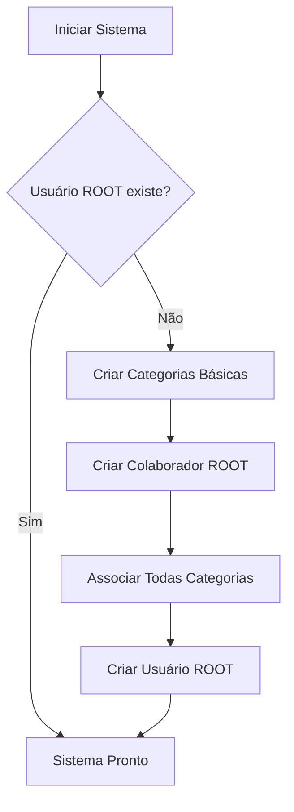

# 🔐 Usuário ROOT - Sistema Sócrates Online

## 📋 Visão Geral

O Sistema Sócrates Online agora possui um sistema de inicialização automática que cria um usuário ROOT com acesso completo a todas as funcionalidades do sistema.

## 🚀 Inicialização Automática

### Quando é Criado?

O usuário ROOT é criado automaticamente:

1. **Na primeira execução da aplicação** (`python app.py`)
2. **No primeiro acesso à tela de login**
3. **Executando o script de inicialização** (`python init_root_user.py`)

### Credenciais Padrão

```
📧 Email: root@socratesonline.com
🔒 Senha: Admin@2025
```

## 🏷️ Categorias Criadas Automaticamente

O sistema cria automaticamente as seguintes categorias de colaborador:

- **Administrativo** - Acesso completo ao sistema
- **Operacional** - Operações básicas
- **Promotor de Vendas** - Funcionalidades de marketing e vendas
- **Produtor** - Gestão de eventos
- **Motorista** - Controle de veículos
- **Técnico** - Suporte técnico

O usuário ROOT é automaticamente associado a **todas** essas categorias.

## 🛠️ Scripts Disponíveis

### 1. Inicialização Manual
```bash
python init_root_user.py
```
- Cria o usuário ROOT se não existir
- Exibe informações detalhadas do processo
- Pode ser executado a qualquer momento

### 2. Teste do Sistema
```bash
python test_root_user.py
```
- Verifica se o usuário ROOT foi criado corretamente
- Testa as credenciais
- Valida as categorias associadas

## 📱 Interface de Login

### Primeiro Acesso

Na primeira vez que alguém acessar o sistema, a tela de login exibirá automaticamente:

- **Alerta informativo** com as credenciais do usuário ROOT
- **Dicas de uso** para o primeiro acesso
- **Instruções** para criar outros usuários

### Após Outros Usuários

Quando existirem outros usuários no sistema, o alerta de primeiro acesso desaparece automaticamente.

## 🔧 Funcionalidades do Usuário ROOT

O usuário ROOT possui:

- ✅ **Acesso total** a todas as funcionalidades
- ✅ **Todas as categorias** de colaborador
- ✅ **Permissões administrativas** completas
- ✅ **Capacidade de criar** outros usuários
- ✅ **Gerenciamento** de categorias e colaboradores

## 🛡️ Segurança

### Recomendações

1. **Altere a senha** após o primeiro login
2. **Crie usuários específicos** para cada função
3. **Use o ROOT apenas** para administração
4. **Mantenha as credenciais** em local seguro

### Proteções Implementadas

- ✅ Senha criptografada com hash seguro
- ✅ Verificação automática de existência
- ✅ Prevenção de duplicação
- ✅ Logs de criação no console

## 🔄 Processo de Inicialização



## 📝 Logs de Exemplo

```
🔄 Criando usuário ROOT do sistema...
📝 Categoria 'Administrativo' criada
📝 Categoria 'Operacional' criada
📝 Categoria 'Promotor de Vendas' criada
📝 Categoria 'Produtor' criada
📝 Categoria 'Motorista' criada
📝 Categoria 'Técnico' criada
👤 Colaborador ROOT criado
🔐 Usuário ROOT criado
✅ Usuário ROOT criado com sucesso!
📧 Email: root@socratesonline.com
🔒 Senha: Admin@2025
🏷️ Categorias: Administrativo, Operacional, Promotor de Vendas, Produtor, Motorista, Técnico
```

## ❓ Solução de Problemas

### Usuário ROOT não foi criado

```bash
# Executar inicialização manual
python init_root_user.py

# Verificar se foi criado
python test_root_user.py
```

### Erro de permissões

- Verifique se o banco de dados está acessível
- Confirme se as migrações foram aplicadas
- Execute com privilégios adequados

### Senha não funciona

- Confirme que está usando: `Admin@2025`
- Verifique se não há espaços extras
- Execute o teste: `python test_root_user.py`

## 📞 Suporte

Em caso de problemas:

1. Execute `python test_root_user.py`
2. Verifique os logs no console
3. Confirme se o ambiente virtual está ativo
4. Verifique se as dependências estão instaladas

---

**Sistema Sócrates Online** - Gestão Completa de Eventos Circenses
